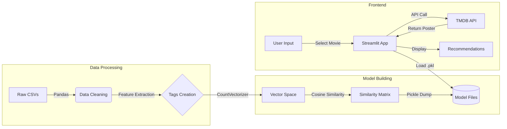

  
  <h1>Movie Recommendation Engine</h1>
  
  

    A Content-Based Machine Learning System that recommends movies similar to your favorites.
  

  
  

  
  
  
  

<h4>
    <a href="#-system-architecture">View Architecture</a>
   · 
    <a href="#-installation">Installation</a>
   · 
    <a href="#-demo">View Demo</a>
</h4>

 

---

# 📍 Overview

This project is a **Content-Based Recommendation System** built using Python and Streamlit. It solves the problem of "choice paralysis" by analyzing metadata from the **TMDB 5000 Movie Dataset** to suggest movies that share narrative, thematic, or production similarities with a user's selection.

### Key Features
| 🚀 Performance | 🎨 UX/UI | 🔧 Engineering |
| :--- | :--- | :--- |
| **Instant Results:**  Generates 5 recommendations in milliseconds using pre-computed similarity matrices. | **Visual Posters:**  Fetches high-res movie posters dynamically via the TMDB API. | **Vectorization:**  Uses `CountVectorizer` to convert text data into numerical vectors. |
| **Smart Filtering:**  Filters based on a combined logic of Cast, Crew, Keywords, and Genres. | **Responsive Design:**  Clean, mobile-friendly interface powered by Streamlit. | **Cosine Similarity:**  Computes the geometric distance between movie vectors to find matches. |

---

# 🧠 How It Works

The engine uses **Cosine Similarity** to measure the distance between movies in a multi-dimensional space.

1.  **Data Cleaning:** We merge the `Credits` and `Movies` datasets.
2.  **Feature Engineering:** We create a unified `tags` column by concatenating:
    * Movie Overview
    * Genres
    * Keywords
    * Top 3 Cast Members
    * Director
3.  **Vectorization:** We remove stop words and apply stemming, then convert the text tags into 5000-dimensional vectors.
4.  **Similarity Metric:** We calculate the cosine of the angle between vectors. A smaller angle implies higher similarity.

$$\text{Cosine Similarity}(A, B) = \frac{A \cdot B}{\|A\| \|B\|}$$

---

# 📐 System Architecture

Below is the high-level data flow pipeline, from raw CSV ingestion to frontend display.

├── data/
│   ├── tmdb_5000_credits.csv   # Source dataset 1
│   └── tmdb_5000_movies.csv    # Source dataset 2
├── models/
│   ├── movies.pkl              # Processed dataframe (generated)
│   └── similarity.pkl          # Similarity matrix (generated)
├── notebooks/
│   └── analysis.ipynb          # Jupyter notebook for training
├── src/
│   └── app.py                  # Main Streamlit application
├── requirements.txt            # Python dependencies
└── README.md                   # Documentation

Installation & Setup
Follow these steps to set up the project locally.

1. Clone the Repository
Bash
git clone [[https://github.com/your-username/movie-recommender.git](https://github.com/your-username/movie-recommender.git)](https://github.com/Soham-o/Movie_Recommender_System.git).
cd movie-recommender

2. Install Dependencies
Bash
pip install -r requirements.txt

3. Generate the Models
Note: Due to file size limits, the model files are not included in the repo. You must generate them.

Open movies_recommendation_system.ipynb in Jupyter Notebook.

Run all cells.

This will generate movies.pkl and similarity.pkl in your directory.

4. Run the App
Bash
streamlit run movies_rs.py

Built with ❤️ using Python and Streamlit

<a href="https://www.themoviedb.org/documentation/api">TMDB API</a> •
<a href="https://streamlit.io">Streamlit Docs</a>

### How to use this:

1.  **Create a file** named `README.md` in your project folder.
2.  **Paste** the code block above into that file.
3.  **Customize:**
      * Replace `https://github.com/Soham-o/movie-recommender.git` with your actual repo URL.
      * If you have screenshots of your app running, replace the `https://via.placeholder.com...` links with the actual paths to your images.
      * Move your `.pkl` files to a `models/` folder if you want to match the structure in the readme, or update the text to match your current flat file structure.
